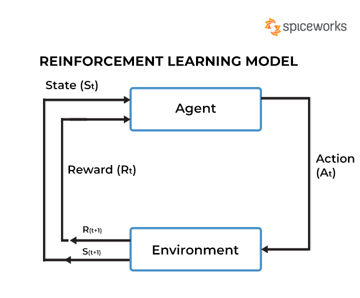

Got it — you want the RL chatbot in a single Python file that:

- Trains with simulated user feedback (or can take live user feedback)

- Uses Reinforcement Learning (Q-learning) to improve

- Is complete and runnable without external setup except pip install scikit-learn

- Here’s a single-file complete working example:

```python
import random
import pickle
import os
import numpy as np
from collections import defaultdict
from sklearn.feature_extraction.text import CountVectorizer

# ------------------------------
# RL Chatbot Agent (Q-Learning)
# ------------------------------
class RLChatbot:
    def __init__(self, actions, alpha=0.1, gamma=0.9, epsilon=0.2):
        self.actions = actions  # possible responses
        self.alpha = alpha      # learning rate
        self.gamma = gamma      # discount factor
        self.epsilon = epsilon  # exploration rate
        self.q_table = defaultdict(lambda: np.zeros(len(actions)))
        self.vectorizer = CountVectorizer()

    def featurize(self, text):
        """Convert input text to a hashed state ID (string key)."""
        return str(hash(text.lower()) % (10**8))

    def choose_action(self, state):
        """Epsilon-greedy action selection."""
        if random.random() < self.epsilon:
            return random.randint(0, len(self.actions) - 1)
        return int(np.argmax(self.q_table[state]))

    def update(self, state, action, reward, next_state):
        """Q-learning update."""
        old_q = self.q_table[state][action]
        next_max = np.max(self.q_table[next_state])
        self.q_table[state][action] += self.alpha * (reward + self.gamma * next_max - old_q)

    def save(self, path="rl_chatbot.pkl"):
        with open(path, "wb") as f:
            pickle.dump((dict(self.q_table), self.actions), f)

    def load(self, path="rl_chatbot.pkl"):
        if os.path.exists(path):
            with open(path, "rb") as f:
                data = pickle.load(f)
                self.q_table = defaultdict(lambda: np.zeros(len(self.actions)), data[0])
                self.actions = data[1]

# ------------------------------
# Simulated training environment
# ------------------------------
def simulated_reward(user_input, bot_response):
    """Fake reward function for simulation:  
       Higher reward if bot_response 'matches' intent."""
    if "hello" in user_input.lower() and "hello" in bot_response.lower():
        return 5
    if "bye" in user_input.lower() and "bye" in bot_response.lower():
        return 5
    if "help" in user_input.lower() and "help" in bot_response.lower():
        return 5
    return -1  # default negative reward

# ------------------------------
# Main program
# ------------------------------
if __name__ == "__main__":
    actions = [
        "Hello! How can I help you?",
        "Goodbye! Have a nice day.",
        "I can help with your problems. What do you need?",
        "I'm not sure I understand.",
        "Please tell me more."
    ]

    agent = RLChatbot(actions)

    # ------------------------------
    # Simulated training phase
    # ------------------------------
    training_data = [
        "hello", "hi there", "bye", "goodbye", "i need help", "can you help me",
        "what's up", "please help", "bye bye", "see you"
    ]

    for episode in range(200):
        user_msg = random.choice(training_data)
        state = agent.featurize(user_msg)
        action = agent.choose_action(state)
        bot_reply = actions[action]
        reward = simulated_reward(user_msg, bot_reply)
        next_state = agent.featurize("end")  # stateless
        agent.update(state, action, reward, next_state)

    print("✅ Training completed (simulated)")

    # Save trained model
    agent.save()

    # ------------------------------
    # Interactive chat
    # ------------------------------
    print("\n🤖 RL Chatbot is ready! Type 'quit' to exit.")
    agent.load()

    while True:
        user_input = input("You: ")
        if user_input.lower() in ["quit", "exit"]:
            break

        state = agent.featurize(user_input)
        action = agent.choose_action(state)
        bot_reply = actions[action]
        print(f"Bot: {bot_reply}")

        # Get human feedback (reward)
        try:
            reward = int(input("Rate this reply (-5 to 5): "))
        except ValueError:
            reward = 0  # default if invalid
        next_state = agent.featurize("end")
        agent.update(state, action, reward, next_state)
        agent.save()

    print("💾 Chatbot model updated and saved.")
```
## How it works:
- Actions: Predefined bot replies.

- Q-learning: Learns which reply works best for each type of user input.

- Training: First, simulated with fake reward rules (matching intent).

- Interactive mode: You chat with it and give feedback (-5 to 5), it updates its policy instantly.

Run it:
```bash
pip install scikit-learn
python rl_chatbot.py
```
If you want, I can now make a neural network-based version (Deep Q-Learning) so the chatbot learns richer, free-form responses instead of a fixed set.
Do you want me to upgrade it to DQN? That way it feels more like ChatGPT learning live from you.